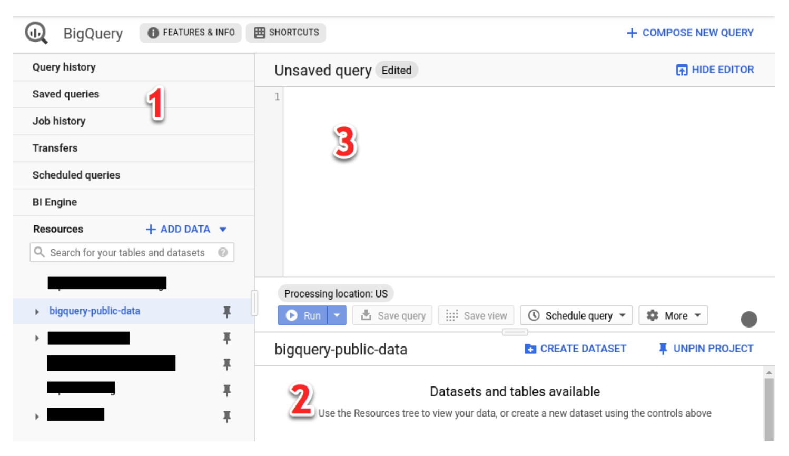
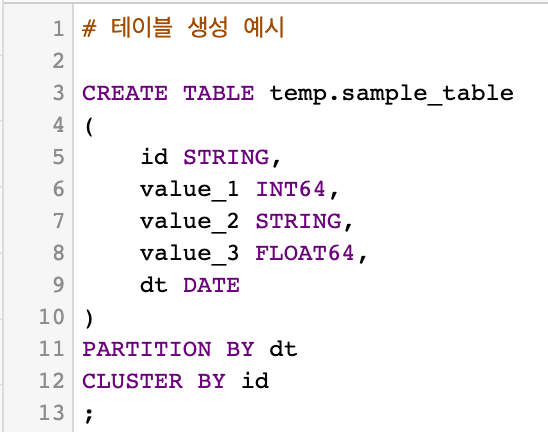
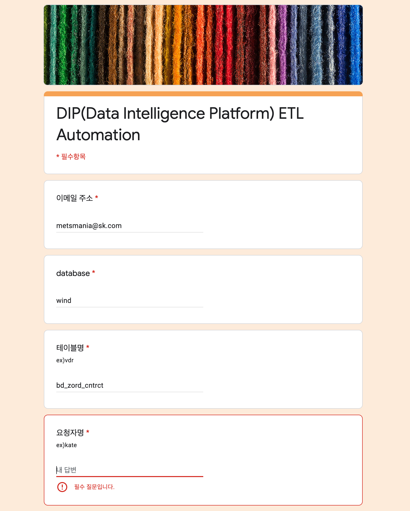

BigQuery 가이드
======================

BigQuery 개요
-------------------------------------------------------------------------

-   **Google Cloud Platform**
-   대규모 데이터에 대한 빠른 **SQL** 처리

BigQuery Interface
-------------------------------------------------------------------------

-   [BigQuery Console (Web UI)](https://cloud.google.com/bigquery/docs/bigquery-web-ui)
    - 브라우저를 통해 Web UI에서 작업을 할 수 있습니다.
    - 가장 간단하고 편하게 사용할 수 있는 방법입니다.
-   [Command Line Interface](https://cloud.google.com/bigquery/docs/bq-command-line-tool) 
    - Google Cloud SDK를 설치하여 터미널에서 접속할 수 있습니다.
-   [BigQuery Client Library](https://cloud.google.com/bigquery/docs/reference/libraries)
    - 빅쿼리와 연동할 수 있는 개발용 라이브러리 입니다. 
-   SKT AIDP 분석환경
    - AIDP 분석환경을 사용하면 Jupyter Notebook에서 직접 BigQuery를 사용할 수 있습니다.

 
BigQuery Console
------------------------------------------------

BigQuery Console에 접속하는 방법입니다.
- 접속
    1. console.cloud.google.com/bigquery 에 접속합니다.
    2. G-Suite 계정(sktai.io로 끝나는 계정)으로 로그인합니다.
        - 로그인 문제가 생기는 경우 담당자(tkyoo@sk.com)에 요청 주시기 바랍니다.
    3. 좌측 상단의 Project를 sktaic-datahub로 세팅합니다.
        

- 화면 설명

    1. 탐색 패널
        - 쿼리 이력, 데이터세트, 테이블 정보 등을 탐색할 수 있습니다.
    2. 세부정보 패널
        - 탐색 패널에서 선택한 데이터세트 및 테이블의 상세 정보를 확인할 수 있습니다.
        - 쿼리 결과를 보여줍니다. 
    3. 쿼리 편집기
        - SQL을 작성하여 실행할 수 있습니다.
        - SQL은 Standard SQL과 Legacy SQL의 2가지 문법을 지원합니다.
            - Standard SQL : 일반적인 표준 SQL 입니다. BigQuery의 기본 쿼리 구문은 표준 SQL입니다.
            - Legacy SQL : BigQuery 초기에 사용되던 문법입니다. Standard SQL을 사용할 것을 권장드립니다.

BigQuery Documentation
------------------------------------------------
BigQuery는 잘 정리된 문서를 제공하고 있습니다.  
간단히 시작할 수 있는 튜토리얼부터 상세한 기능까지 자세하게 설명되어 있습니다.  
BigQuery를 사용하시면서 문서를 잘 활용하실 것을 추천드립니다.

BigQuery 주요 기능
------------------------------------------------
간략히 파악할 수 있는 주요 기능에 대한 소개입니다.
- SQL

- 파티션
    - 싱글 컬럼 파티션
        - BigQuery의 테이블은 단일 컬럼에 대한 파티셔닝만 가능합니다.
    - 파티션 타입
        - 파티션 컬럼의 타입은 **날짜 또는 타임스탬프**와 **정수 범위**만 지원합니다.

- 클러스터링
    - 클러스터링은 데이터의 정렬 순서를 결정합니다.
    - 인덱싱과 비슷하다고 보면 됩니다.
    - 여러 개의 컬럼을 클러스터링 하는 것이 가능합니다.

- 테이블 생성 예시  

- View
    - 뷰는 SQL 쿼로 정의하는 가상 테이블입니다. 뷰를 만들 때는 테이블을 쿼리할 때와 같은 방식으로 쿼리합니다.

DataLake → BigQuery 데이터 적재 프로세스
------------------------------------------------
SKT DataLake 저장되어 있는 테이블을 BigQuery에 적재하는 프로세스를 제공합니다.
정의된 양식을 작성해주시면 DataLake 담당자와 협의한 후 데이터가 내부 파이프라인을 거쳐 BigQuery에 적재됩니다.

- 테이블 적재 신청 방법
    1. [이곳](docs.google.com/forms/d/e/1FAIpQLSfk_zkIkdzz1k6y_-2vNKuJRHjSDRH2Q6qdkv4mb9C6pOC9cw/viewform)에 접속하여 신청 양식을 작성합니다.  
    
    2. 신청 후에 데이터가 적재되기까지 2~3일 정도 걸릴 수 있습니다. 혹시 데이터 적재가 지연되거나 궁금한 사항이 있으신 경우 담당자(<metsmania@sk.com>)에게 문의주시기 바랍니다.

AIDP 분석환경에서 BigQuery 사용하기
------------------------------------------------
AIDP 분석환경은 Jupyter Notebook을 분석도구로 제공합니다. 이 분석환경에서 BigQuery와 연동해서 사용하는 것이 가능합니다.
- 제공 기능
    - BigQuery SQL 실행 및 결과를 확인할 수 있습니다.
    - BigQuery SQL 실행 결과를 Pandas Dataframe 또는 Spark Dataframe으로 변환할 수 있습니다.
    - Pandas Dataframe 또는 Spark Dataframe을 BigQeury 테이블에 저장할 수 있습니다. 
- [샘플 코드](https://github.com/sktaiflow/dag-samples/blob/develop/notebooks/bigquery_samples.ipynb)

